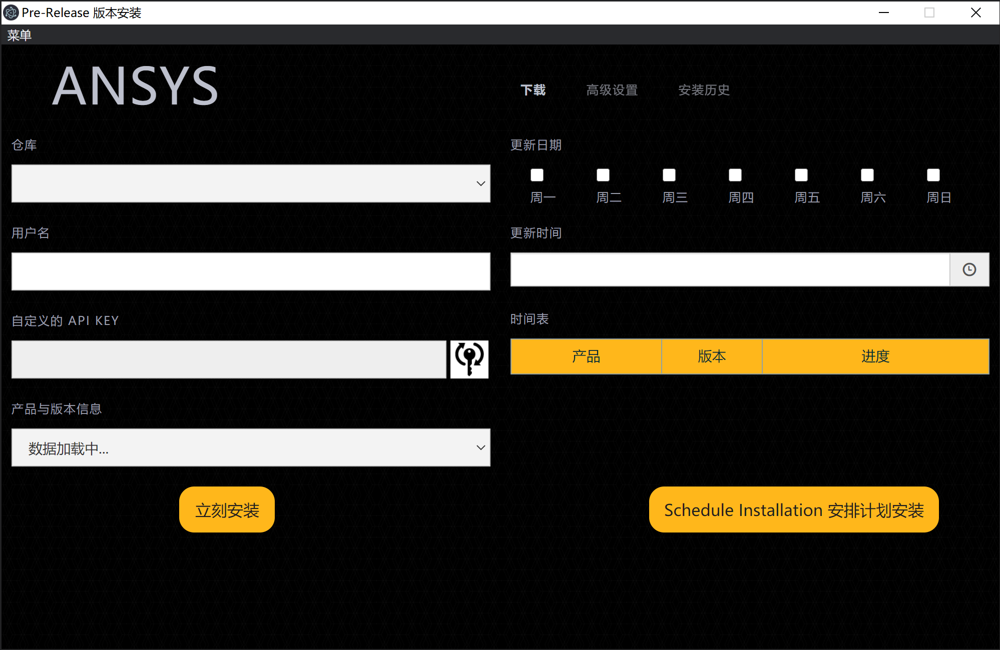

      <a href="README.md">English</a> | 中文

# 简介

当前项目有助于实现 `Ansys` 内部构建版本下载和安装流程的自动化。
该软件将取代工程师下载和安装测试版 `Ansys Electronics Desktop`、`Ansys Workbench` 和 `Ansys License Manager` 所需的手动操作。

有两种可能的模式: 
1. 部分自动化：用户通过单击 `立即安装` 按钮安装构建。
2. 完全自动化：在特定日期和时间安排自动更新，无需任何用户交互。

用户可以从可用的 `Ansys Artifactory`（需要VPN或Ansys的内部网络）或 `Ansys Sharepoint`（无VPN）安装构建版本。

# Ansys 构建、下载、安装

您可以从以下网址 [GitHub Releases](https://github.com/ansys/pre-release-installer/releases) 下载最新的 `Ansys Beta版本` 安装程序。

如果您已经安装了任何版本的 `Ansys Build Downloader`，它将在下次启动时[自动更新](#tool-autoupdate)。

用户始终可以在 _`Installation History panel`_（安装历史记录界面）上查看下载和安装进度。
如果您想要终止进程仅仅只需在同一页面内点击 _`Runing Progress`_（运行进程）的那一行。

# 使用方法

几乎每个菜单项都提供了工具提示来引导用户。

有两个选项作为 _`beta`_ 版本的源代码，您可以在 `存储库 [Repository]` 菜单下选择：
1. SharePoint （默认）：无需 VPN 连接
2. Ansys Artifactory（推荐用于工作站和办公机器）

要从 `Artifactory` 下载，您必须使用 `VPN` 并使用 `API` 密钥。
单击 `Key` 按钮并提供您的 `Ansys SSO` 密码以请求 `Artifactory API` 密钥。

在确定好存储库的源之后，您可以通过点击 _`Install Now`_  按钮按需安装软件，或者通过点击 _`Schedule Installation`_ 设置每周的安装计划。工具在后台以非图形方式运行。
单击 _`Install Now`_ 或 _`Schedule Installation`_ 后，您可以关闭窗口。

如果您需要，可以进行以下高级设置：
1. 设置安装与下载的路径。
2. 设置 `Ansys Electronics Desktop` 的 `HPC` 或注册表文件选项。
3. 从 _`Workbench`_（工作台）中选择仅需要安装的特定产品。
4. 设置安装完成后是否保留安装包。

# 常见问题与功能

1. 如果您运行的 `Ansys BETA` 软件版本相同（例如2022R1），则下载和安装将会被跳过。
这样做是为了防止构建的损坏，因为在软件运行期间，一些文件可能被锁定，从而导致包损坏。
2. 只有在所选存储库中存在版本更新时，才会下载并安装软件。
3. 您无法下载 _`Workbench`_（工作台）的部分安装包，而是更改为在您的工作时间之外安排安装。
4. 目前该工具仅支持 Windows 操作系统，需要使用（管理员）用户的身份运行。

## 安装工具的自动更新
应用将在 UI 启动时自动更新

# 贡献
如果您想为当前项目做出贡献，可以使用如下方式：

1. 提交代码更改，请参阅 [CONTRIBUTE.md](docs/CONTRIBUTE.md)
2. Open an issue (defect-缺陷) on GitHub issues
3. Open user story (feature suggestion-功能建议) on GitHub issues

您可以随时将您的建议发送至：[Our Team](mailto:betadownloader@ansys.com)
